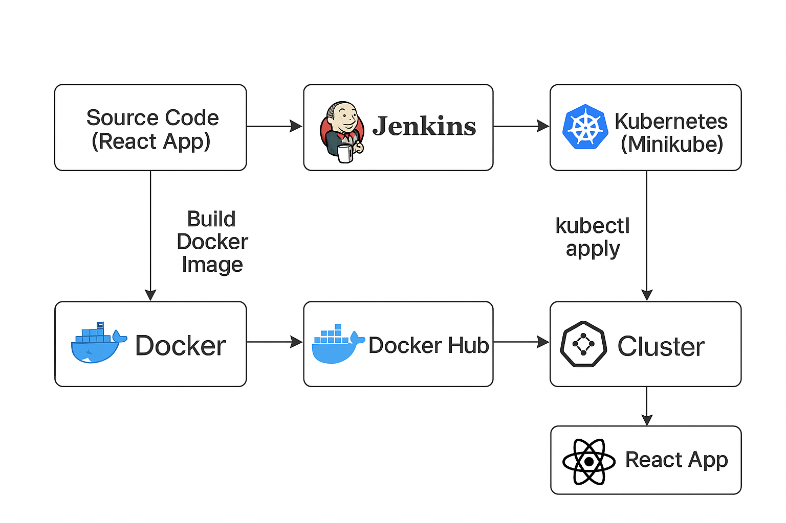

<<<<<<< HEAD
# react-cicd-pipeline
=======
# React + Jenkins + Docker + Kubernetes 🚀


This project is a simple **React application** that demonstrates a CI/CD pipeline using:
- **Jenkins** for automation
- **Docker** for containerization
- **Kubernetes** for deployment and scaling

---

## 📂 Project Structure

├── deployment/ # Kubernetes manifests (YAML files)
├── public/ # Static assets and index.html
├── src/ # React source code
│ └── index.js
├── .dockerignore # Files ignored during Docker build
├── Dockerfile # Docker image definition
├── Jenkinsfile # Jenkins pipeline definition
├── package.json # Dependencies and scripts
└── README.md # Project documentation


---

## ⚡ How to Run Locally

### 1️⃣ Install dependencies
```bash
npm install
2️⃣ Start the React app
npm start


The app will be available at http://localhost:3000

🐳 Docker Build & Run
Build Docker image
docker build -t react-jenkins-docker-k8s .

Run container
docker run -p 3000:3000 react-jenkins-docker-k8s

🔄 CI/CD with Jenkins

Jenkins will:

Pull the code from GitHub

Build the Docker image

Push it to DockerHub

Deploy it to Kubernetes

☸️ Deploy to Kubernetes

Apply the manifests from the deployment/ folder:

kubectl apply -f deployment/


Check running pods:

kubectl get pods




https://chatgpt.com/s/m_68c5c7e8ebb8819186b9a51b6472a9f0
